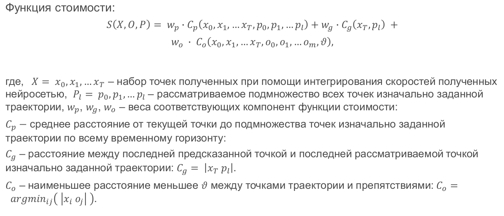

# Model Predictive Path Integral

## Введение 
В данном репозитории представлена реализация метода Model Predictive Path Integral на языке Python c использованием параметрической идентификации модели при помощи нейронной сети, а также программные компоненты для тестирования данного метода. 


## Запуск тестового проезда
Тестовые проезды проводятся на заранее заданных путях. Для запуска алгоритма на тестовых проездах необходимо запустить лаунч фаил и вызвать сервис для публикации пути:
```
roslaunch rosbot_controller mppi.launch
rosservice call /next_path
```

## Описание алгоритма
Алгоритм представляет собой расчет средневзвешенного управления по случайно сгенерированным управляющим воздействиям на основании функции стоимости, которая высчитывается для каждой последовательности управляющих воздействий отдельно. Функция стоимости расчитывается над траекториями полученными при помощи интегрирования скоростей, которые в своей очередь получены рекурсивным применения модели робота (в данной реализации линейной, идентифицированной нейросетью).



## Как задать путь?
Для того чтобы задать путь необходимо изменить параметр "paths" в config/paths.yaml. На данный момент поддерживается два вида пути: sin, polygon. Для каждого типа существует набор уникальных параметров (args). Пример:

```
paths : [
    {
        'type': 'sin',
        'args': {'step': 0.1, 'amplitude': 1.0, 'freq' : 0.1 }
    },
    {
        'type': 'polygon',
        'args': {'step': 0.1, 'edges': [[0.0, 0.0], [0.0, 5.0], [5.0, 5.0], [5.0, 0.0] ] }
    }
]
```
Заданные пути можно последовательно менять вызовом сервиса ```/next_path```. 

## Как задать препятствия?
Препятствия в данной реализации задаются как точки с некоторым радиусом. Для того чтобы их задать 
необходимо изменить параметр "obstacles в config/mppi.yaml. Формат препятствия [x, y, radius]. Пример:
```
obstacles: [              
              [1, 0,  0.3],
              [2.5, 0.55,  0.3]
           ]
```


## Параметры


| Parameter       | Type   | Default | Definition                                                                                                  |
| --------------- | ------ | ------- | ----------------------------------------------------------------------------------------------------------- |
| traj_vis_step   | int    | 10      | Шаг по которому определяется какие траектории следует визуализировать (10 означает каждую десятую)          |
| iter_count      | int    | 2       | Количество итераций алгоритма MPPI                                                                          |
| traj_lookahead  | double | 1.5     | Расстояние глобальной траектории которое доступно локальному планировщику                                   |
| batch_size      | int    | 300     | Количество генерируемых траекторий                                                                          |
| time_steps      | int    | 20      | Количество временых шагов по которым строятся траектории                                                    |
| model_dt        | double | 0.1     | Время одного шага                                                                                           |
| v_std           | double | 0.1     | Стандартное отклонение случайного распределения линейной скорости                                           |
| w_std           | double | 0.3     | Стандартное отклонение случайного распределения угловой скорости                                            |
| limit_v         | double | 0.5     | Предел на задаваемую линейную скорость                                                                      |
| limit_w         | double | 1.3     | Предел на задаваемую угловую скорость                                                                       |
| temperature     | double | 0.25    | Параметр определяющий "избирательность" траекторий в методе MPPI                                            |
| goal_weight     | double | 30      | Вес компоненты цели в функции стоимости                                                                     |
| goal_power      | int    | 1       | Степень в которую возводится компонента цели в функции стоимости                                            |
| reference_weigh | double | 1       | Вес компоненты референсной траектории в функции стоимости                                                   |
| reference_power | int    | 1       | Степень в которую возводится компонента референсной траектории в функции стоимости                          |
| obstacle_weight | double | 100     | Вес компоненты препятствий в функции стоимости                                                              |
| obstacle_power  | int    | 1       | Степень в которую возводится компонента препятствий в функции стоимости                                     |
| stop_robot      | bool   | False   | Останавливает робота                                                                                        |
| wait_full_step  | bool   | True    | Следующее управляющее воздействие начинает рассчитываться только по истечению времени кратному параметру dt |
| visualize       | bool   | True    | Включает визуализацию в RViz                                                                                |


## Изменение параметров
Вы можете изменить параметры работы алгоритма в процессе его работы используя dynamic_reconfigure в rqt. 
По умолчанию параметры заданы в cfg/MPPI.cfg.
